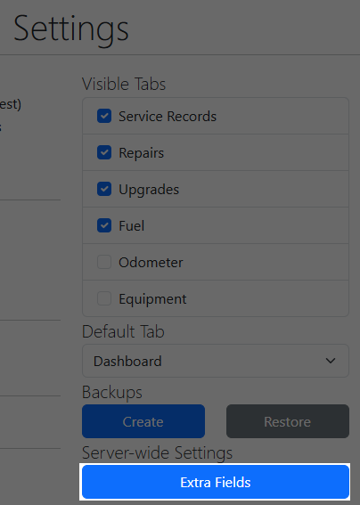
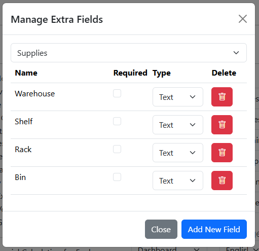
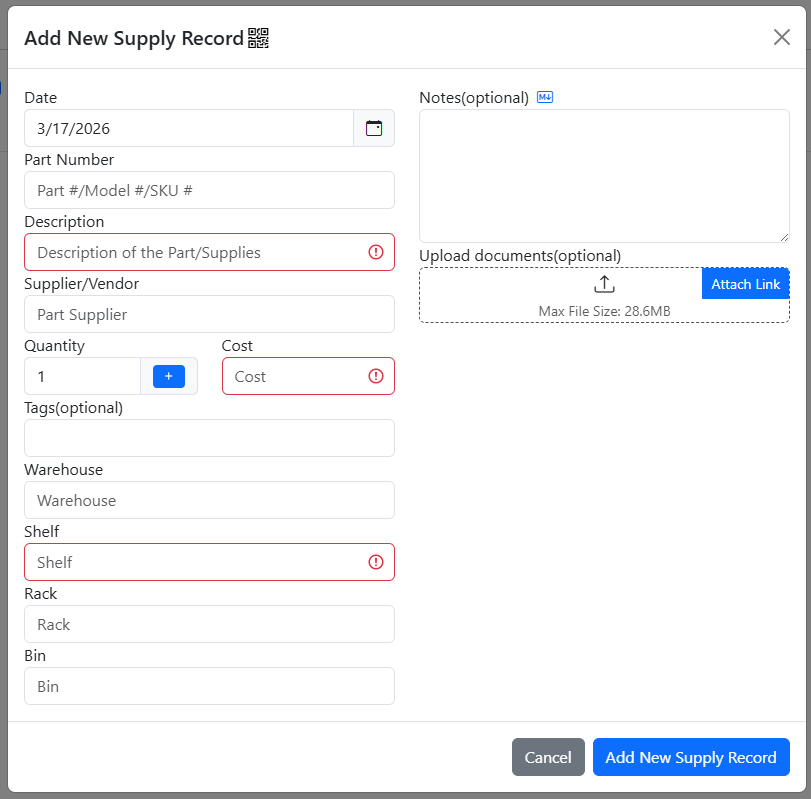
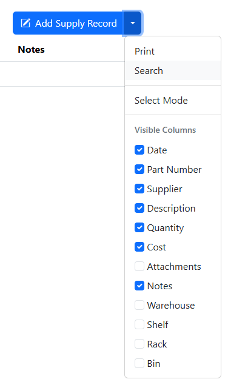
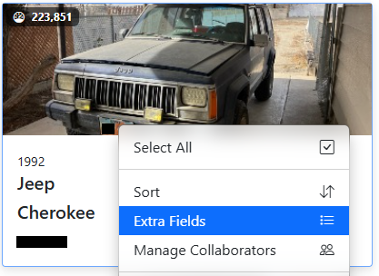

# Additional Fields

If you require more fields than what is provided in LubeLogger, you can easily add more fields via the Additional Fields Manager located in the Settings tab. You have to be logged in as the root user in order to access this feature.

The Additional Fields Manager contains a dropdown that contains the records you can append additional tabs to along with a list of additional fields for that record.

You can also mark additional fields as required, which means that they have to be filled out when adding / editing records or the system will throw an error.

## Displaying Additional Fields

If both the "Show Extra Field Columns" and "Enable CSV Imports" options are enabled in Settings, users can view and search records using additional fields.

To make the additional field columns visible, simply check the column name in the dropdown right next to the Add Record button.

Note: the additional field option will only be displayed in the dropdown if any of the records have data in said field. i.e.: if you have an additional field configured for Supplies named `Warehouse`, the option for `Warehouse` in the dropdown menu will only show up if at least one record have data in the `Warehouse` field.

## Vehicle Level Additional Fields

Extra Fields at the vehicle-level can be quickly accessed from the Garage tab by right clicking on the vehicle and then clicking "Extra Fields"

