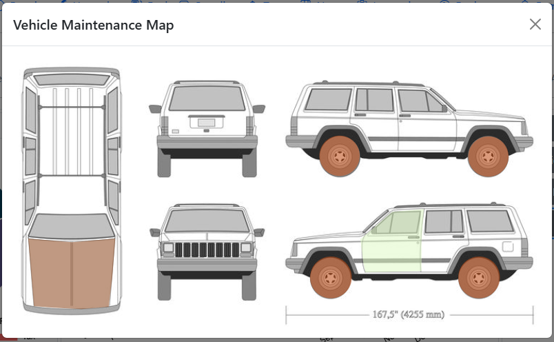

# Vehicle Maps

## What is a Vehicle Map

A vehicle map is an image of the vehicle that has interactive clickable elements overlaid on them that will allow the users to view records that are tied to those elements via tags.



## Creating Vehicle Maps

### Useful Resources:

- [Base64-Image](https://www.base64-image.de/) for converting images to base64
- [Image-Map](https://www.image-map.net/) for creating coordinates
- [Coolors](https://coolors.co/) for generating color templates
- [Vehicle Image Maps Repository](https://github.com/Zeromark30/Lubelogvehiclemap) by [Zeromark30](https://github.com/Zeromark30)

### Template

```
{
	"ImageLink": "",
	"Height": 0,
	"Width": 0,
	"Map": [
		{
			"Tags": "",
			"Coordinates": "",
			"Color": "#",
			"Shape": "",
			"Opacity": 0.5,
			"HoverOpacity": 0.75,
			"Operation": "or"
		},
		{
			"Tags": "",
			"Coordinates": "",
			"Color": "#",
			"Shape": "",
			"Opacity": 0.5,
			"HoverOpacity": 0.75,
			"Operation": "and"
		}
	]
}
```

- ImageLink refers to the Base64 encoded image, but you can also put a link in there that points to an image
- Height refers to the height of the image
- Width refers to the width of the image
- Map.Tags refers to the tags, separated by an empty space that the records should be filtered with
- Map.Coordinates refers to the coordinates of the points generated by an image map creator
- Map.Color refers to the color of the overlay
- Map.Shape refers to the shape(circle or polygon, optional, defaults to polygon)
- Map.Opacity refers to the opacity of the overlay(values range from 0.0 to 1.0, 0.0 is completely transparent and 1.0 is completely opaque)
- Map.HoverOpacity refers to the opacity of the overlay when the mouse cursor hovers over it(value ranges from 0.0 to 1.0)
- Map.Operation refers to how the tags are used to filter records(valid values: `and`, `or`, defaults to `or`)
- Trailing Commas are not supported and must be truncated

#### Tags Filter Operation

Starting in version 1.7.3, the vehicle image map supports different tag filter operations.

OR(Default): Matches records that have at least one tag in the `Tags` filter. Meaning that if the filter is `tires axles` it will return records tagged with either `tires`, `axles`, or both

AND: Matches records that have all of the tags in the `Tags` filter. Meaning that if the filter is `tires axles` it will only return records tagged with both `tires` and `axles`. Not limited to just those tags, so records tagged with `tires`, `axles`, and `front` will also be returned.

### Circles

Starting in version 1.5.2, the vehicle image map supports a circle shape, you must have exactly three coordinates in the following order: x, y, and radius. If you generated your coordinates using circle as the type in [Image-Map](https://www.image-map.net/) then the coordinates are automatically in that order.

[Sample Vehicle Map](https://github.com/hargata/lubelog_scripts/blob/main/misc/sample_vehicle_map.json)

[7-Minute Video Tutorial](https://www.youtube.com/watch?v=IB-HniEtSyk)
