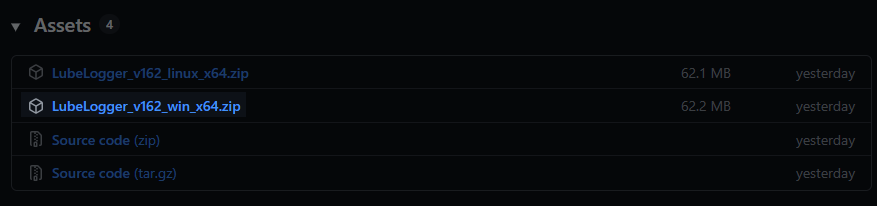
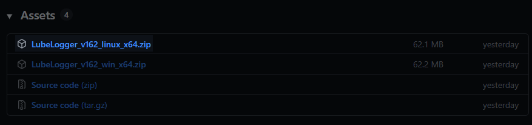

# Getting Started
## Docker

[Youtube Tutorial](https://www.youtube.com/playlist?list=PL2aZOA2wNP8tn-Py-XTF-B6nfx8l-4SwA)

The Docker Container Repository is the most reliable and up-to-date distribution channel for LubeLogger.
You need to have Docker installed and Virtualization enabled(typically a BIOS setting).

You will then clone [docker-compose.yml](https://github.com/hargata/lubelog/blob/main/docker-compose.yml) onto your computer from the repository.

Run the following commands to pull down the image and run container.
```
docker pull ghcr.io/hargata/lubelogger:latest
docker compose up -d
```
By default the app will start listening at localhost:8080, this port can be configured in the docker-compose file.

[Docker Image Mirror](https://hub.docker.com/r/hargata/lubelogger) on Docker Hub

### Kubernetes Deployment
[Helm Chart](https://artifacthub.io/packages/helm/anza-labs/lubelogger) provided by [Anza-Labs](https://github.com/anza-labs)

### Edge-tagged Image
The `:edge` tagged Docker image may contain features that are considered experimental/not fully tested but have been merged into the main branch, use at your own risk. If you're building the Docker image manually and are cloning directly from the main branch of the repository, your local copy of the repository will contain those experimental features.

## Windows Standalone Executable
Windows Standalone Executables(EXE) are provided, and can be found under assets for the [latest release](https://github.com/hargata/lubelog/releases/latest)



To run the server, you just have to download the zip archive attached to the release, usually named LubeLogger_vNNN_win_x64.zip, extract the archive and double click on CarCareTracker.exe

When using this approach, the default port the app will be listening on is 5000, so you will navigate to localhost:5000

## Linux Baremetal
Linux executables are provided and can be found under assets for the [latest release](https://github.com/hargata/lubelog/releases/latest)



[Youtube Tutorial](https://www.youtube.com/playlist?list=PL2aZOA2wNP8tR21myT_s0T0tneoRi0vdT)

To run the Linux executable, download the zip file named LubeLogger_vNNN_linux_x64.zip, extract it and run the following commands:

```
chmod 777 ./CarCareTracker
./CarCareTracker
```

**Note:** `chmod 777` above is only used to rule out permission quirks/issues, please restrict the permissions to the lowest acceptable level once you have verified that LubeLogger can be executed on your machine.

## Test that It Works
Whichever path you choose, once you get the app up and running, just navigate to the IP address and port the server is listening to and you should be able to see the app

Next Steps: [Configuring Server Settings](/Installation/Server Settings)