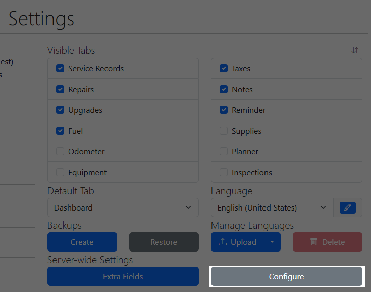
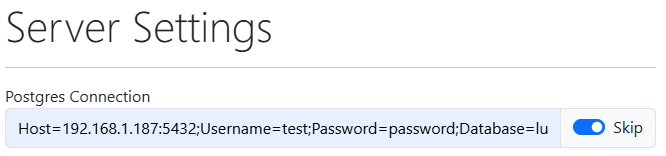
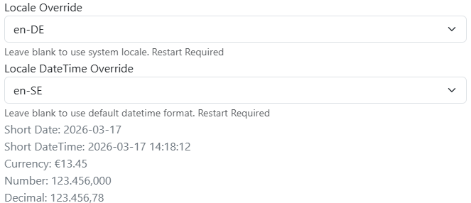
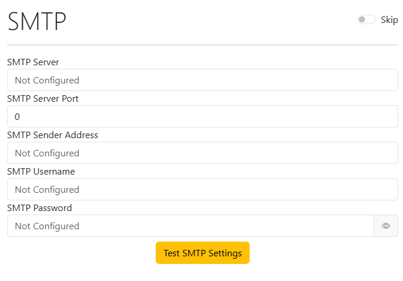
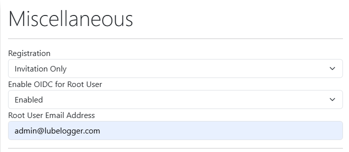

# Configuring Server Settings

The Server Settings Configurator allows you to configure server-wide settings such as Postgres, Locale, SMTP, OIDC, etc.

You can access the Server Settings Configurator from within the Settings tab or via `/setup`

## Skipped Settings

Server settings are saved in `/data/config/serverConfig.json` and are included in the backups created in the Settings tab.

Certain settings such as the Postgres connection string, have a "Skip" option. Check this for settings that you want to be injected via Environment Variables and it will not save the specific setting within the `serverConfig.json` file.

## Locale Overrides

This is the primary way of configuring locale in LubeLogger and serves as an alternative to injecting LANG and LC_ALL in the environment variables. It allows you to set a locale that LubeLogger uses along with a date override. This will allow you to mix and match different locales and their date formats i.e.: using en-DE locale for currency and number formats but you wish to use ISO-8601(yyyy-MM-dd) for date formats instead of MM/dd/yyyy

Changing locale settings will require LubeLogger to be restarted, for docker this means restarting the container, for Windows/Linux executable this means closing out the console app and re-opening it.

### Common Date Locale Overrides

- en-SE provides ISO8601(YYYY-MM-DD) format while preserving English month names.
- en-GB provides (DD/MM/YYYY) format

## SMTP

You can configure and test the SMTP settings within the Server Settings Configurator

## Root User OIDC

You can enable OIDC authentication for the Root User in the Miscellaneous section of the Server Settings Configurator

The Root User Email Address will be used to identify which email coming from the IdP will be used to authenticate the user as the Root User. This email is also used as the default reminder email address for when the `/api/vehicle/reminders/send` is called.