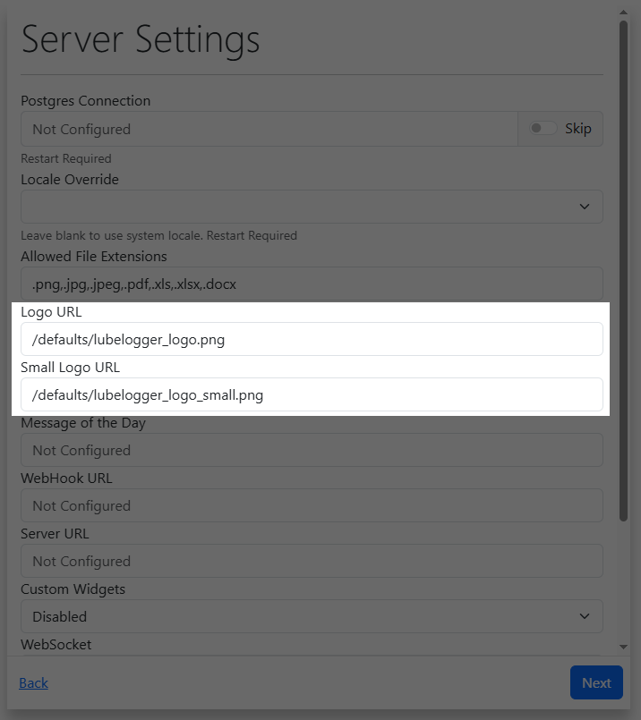

# Replacing The LubeLogger Logo

You can overwrite the LubeLogger Logo that is displayed in the Login and Home/Garage page.

To do so, navigate to the Server Settings Configurator and override both the Logo and Small Logo URL:

Default size for the Logo is 204 x 48px

Default size for the Small Logo is 48 x 48px

## Non-replaceable Locations
- Logo in the About section in the Settings tab
