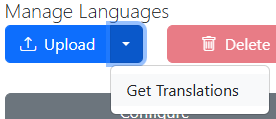
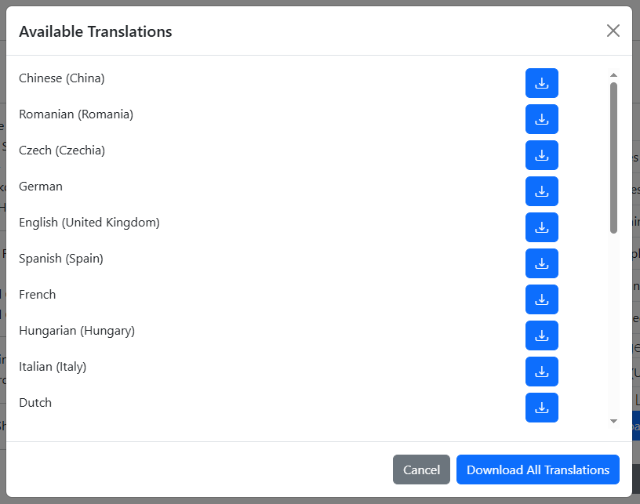
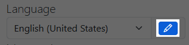
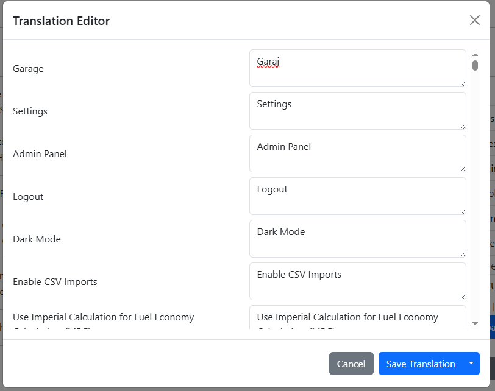
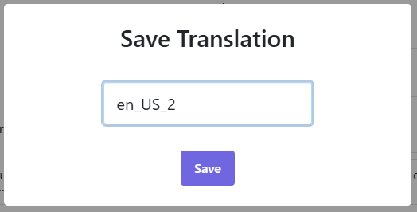
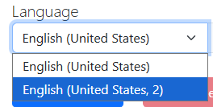
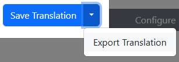

# Translations

LubeLogger supports UI Translations for ~95% of UI elements.

The following are not covered by translations:
- Toasts(messages that pop up on the top right)
- Sweetalert prompts(confirm delete dialogs, etc)
- About section

## How to Download Translations

1. Login as the root user
2. Navigate to "Settings"
3. Click on the dropdown next to the Upload button
4. Click on "Get Translations"
5. The Translation Downloader will show up
6. You can download either just one or all translations.
7. Select the language file from the dropdown to set it as your default language.

## Creating Your Own Translation

1. Login as the root user
2. Click on the Edit button right next to the language selector
3. The translator editor will show up
4. Modify the values in the right.
5. Click "Save Translation"
6. You will be prompted to name your translation, note that "en_US" is reserved
7. Select your custom translation from the dropdown

## Exporting Your Translation

1. Click on the Edit button again to bring up the translation editor
2. Click on the dropdown next to "Save Translation"
3. Click "Export Translation"
4. You should be redirected to a pretty-printed and ordered json file
5. Right click > Save-As to save the translation file
6. Follow the instructions outlined in the [official repository](https://github.com/hargata/lubelog_translations/)

Translation efforts are coordinated via [this thread](https://github.com/hargata/lubelog/discussions/240)
