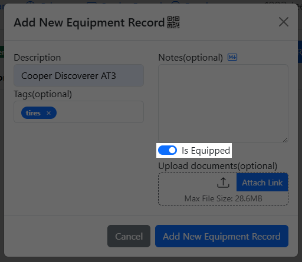
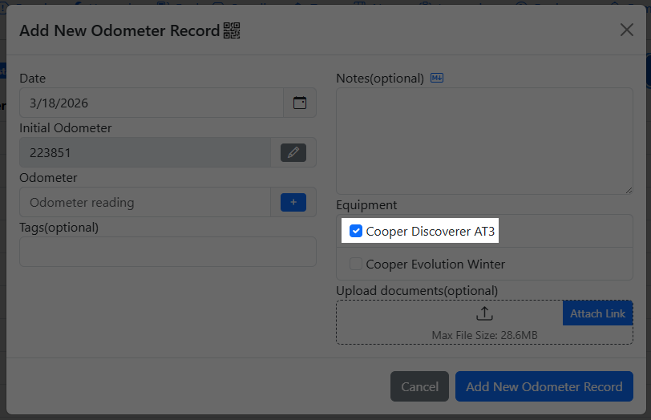
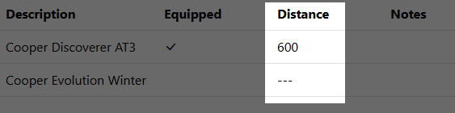
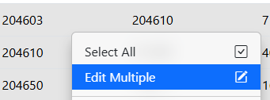
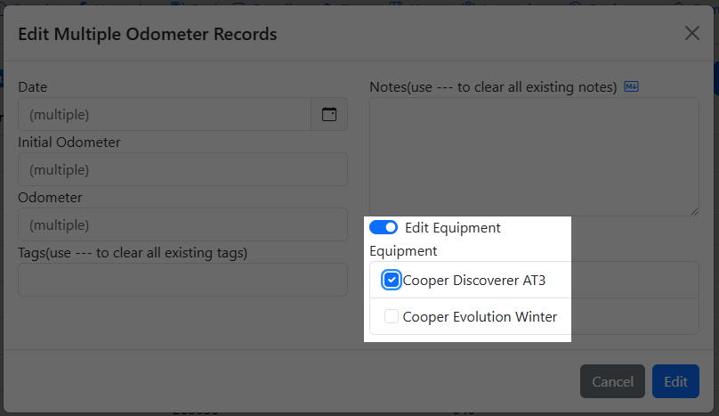

# Equipment

Equipment Records allow you to track distance accumulated for equipment on your vehicle.

Use cases include but not limited to:
- keeping track of seasonal tire sets
- trailers
- motorcycle sidecars

## How it works

When you create an equipment, you have the option of marking it as "Is Equipped"



When "Is Equipped" is selected for the equipment, it will be equipped by default when an odometer record is added, either manually or via the auto-insert when adding other records(when auto-insert is enabled), for API integration, see notes on API below.



The "Distance" column in the Equipment tab displays the total amount of distance based on the odometer records associated where the equipment is equipped.



## Attaching Equipment to existing Odometer Records

You can either edit the Odometer Records one by one or selecting multiple of them, right click and select "Edit Multiple"



Then enable "Edit Equipment" and then select the equipment



Note that "Edit Equipment" will override any equipment that was previously linked to the selected records.

## Note on API

When Auto-Insert Odometer Records is enabled, calling the following endpoints will automatically insert an odometer record with any equipment marked as "Is Equipped"

- /api/vehicle/servicerecords/add
- /api/vehicle/repairrecords/add
- /api/vehicle/upgraderecords/add
- /api/vehicle/gasrecords/add

The `/api/vehicle/odometerrecords/add` endpoint does not automatically link equipment to the newly created odometer record. This is by design because this endpoint allows users to insert odometer records in the past, which may or may not have the equipment on it.

If you wish to utilize the "Add Odometer Record" endpoint and have equipped equipment automatically linked to it, add in a `autoIncludeEquipment` parameter set to true.

Example:
```
{
  "date": "2026-01-03",
  "initialOdometer": 15000,
  "odometer": 16500,
  "notes": "test",
  "tags": "testing",
  "autoIncludeEquipment": true
}
```

If you wish to edit past odometer records and have equipment that are no longer equipped, you can add the id's of the equipment in a string connected by spaces.

Example:
```
{
  "date": "2026-01-03",
  "initialOdometer": 15000,
  "odometer": 16500,
  "notes": "test",
  "tags": "testing",
  "equipmentRecordId": "1 2 3 4 5"
}
```
