# Inspections

Inspection Records allow you to fill out inspection forms for your vehicles and create action items.

## Creating a Template

[Video Walkthrough](https://www.youtube.com/watch?v=_SBe_7bNMuk)

To add an inspection record, you must first create a template.

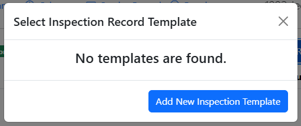

### Adding Fields

Click "Add Field" to add a field to the form

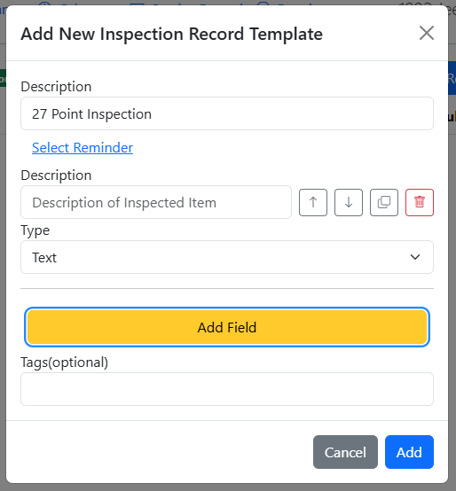

### Field Types

- Text Field - A straightforward input field

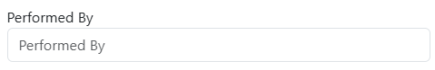

- Radio Selections - Users must select only one option

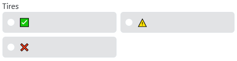

- Check Selections - Users can select multiple or no options.

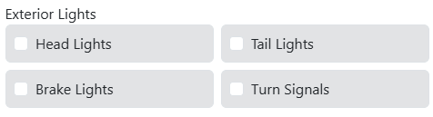

### Adding Options

Radio and Check Field Types require users to create at least one option. Click "Add Option" to add an option

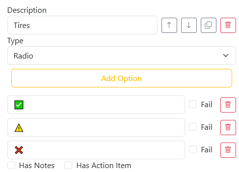

To mark a selection as a failing criteria, check "Fail" next to the field.

#### Field Evaluation

For Radio Field, the item will be evaluated as "Fail" if the option marked as "Fail" is selected.

In this example with Front Tires, this item will be evaluated as "Fail" if "❌" is selected

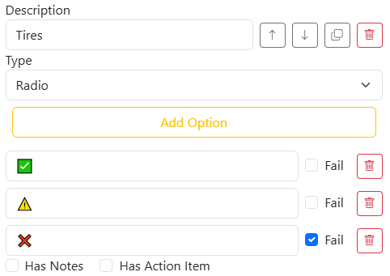

For Check Fields, the item will be evaluated as "Fail" if the option marked as "Fail" is not selected.

In this example with Seatbelts, this item will be evaluated as "Fail" if any of the options are not  selected.

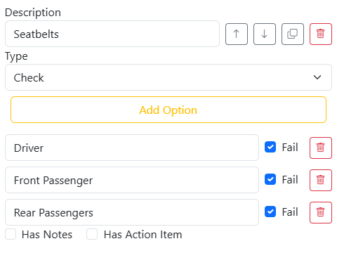

In this example with Exterior Lights, "High Beam" can be unselected and the item will still pass as long as all the other options are selected.

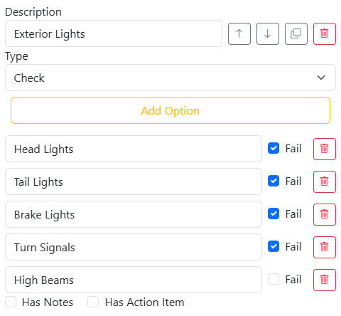

### Action Items

To add an action item to the field, check "Has Action Item" and fill out the details of the Action Item. Action Item will be created in [Planner](records/planner) if the field is evaluated as "Fail".

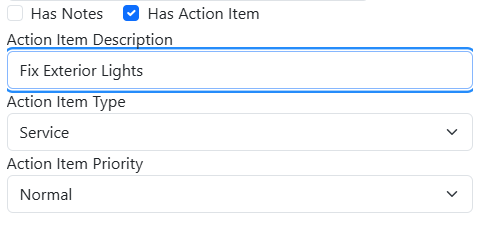

## Using a Template

Once a template has been created, the template selector should now have the name of the template.

Click the "+" button to use the template as an inspection form

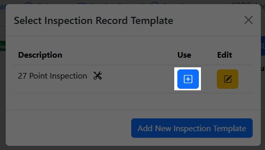

Templates with Reminders are indicated by the bell icon; templates with any action items are indicated by the tools icon.

Once you have filled out the inspection form, click "Add Inspection Record" and the record will be created alongside with a Service Record.

### Immutability

By design, once an Inspection Record has been created, the user cannot return to the Inspection Record to modify any fields except for Attachments and Tags. The Service Record that is created in conjunction with the Inspection Record will allow you to correct any errors in Date, Mileage, or Cost but those fields cannot be edited in the actual Inspection Record. If there is a field that was incorrectly evaluated as "Fail" due to an incorrect selection by the user, you will need to create a new inspection record.

## Inspection Record Evaluation

Inspection Records will evaluate as "Fail" if any one of its fields is evaluated as "Fail"

Criterias that caused the field to be evaluated as "Fail" will be highlighted in red and can be viewed in the Inspection Record

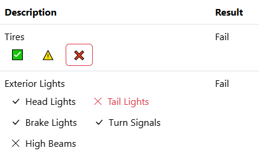

## Duplicating Inspection Templates

You can duplicate existing Inspection Templates by going into edit mode and clicking the dropdown next to the "Edit" button:

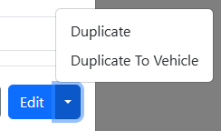
