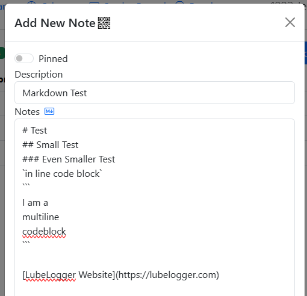
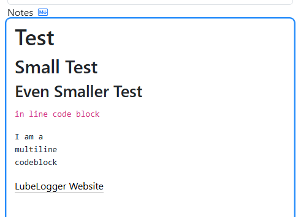
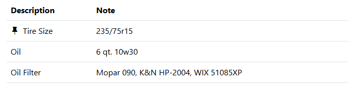
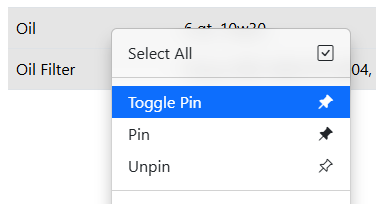

# Notes

The Notes tab contains important notes about your vehicle.

## Markdown Parsing
Markdown formatting is supported across all Notes fields in the app. The underlying markdown parser is [Drawdown](https://github.com/adamvleggett/drawdown). To toggle between edit and preview mode, simply click on the markdown icon next to the "Notes" label.

There is also a setting, that when enabled, will automatically load all notes in Markdown form when viewing existing records. The only exception is when an existing record has an empty notes field.

## Pinned Notes
Notes can be pinned by checking the "Pinned" switch when creating or editing a note.

Pinned Notes will always show up at the very top of the list.

## Bulk Operations
On top of the standard Duplicate and Delete functions for records, you can also toggle, pin, or unpin notes in bulk.

- Toggle Pin - If the record is pinned it will be unpinned and vice versa.
- Pin - Pin the selected records if they aren't pinned.
- Unpin - Unpin the selected records if they're pinned.
