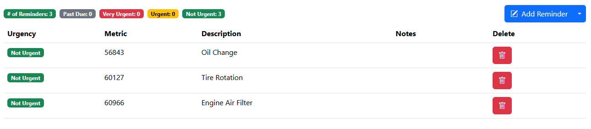
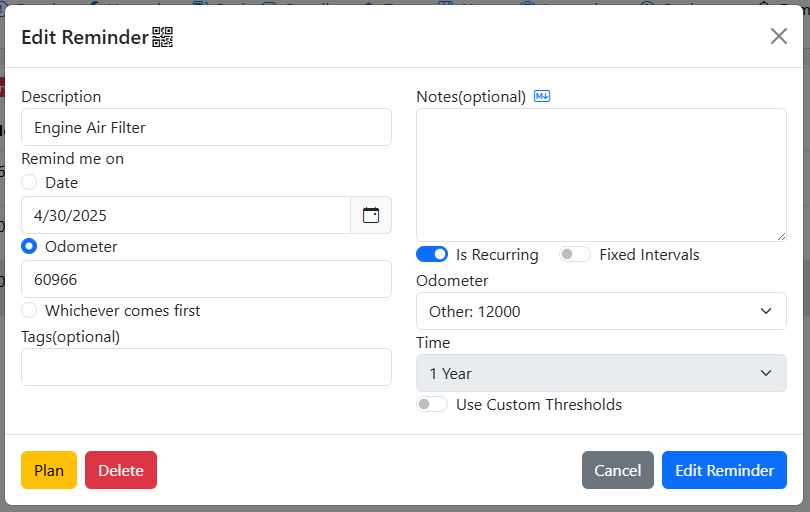
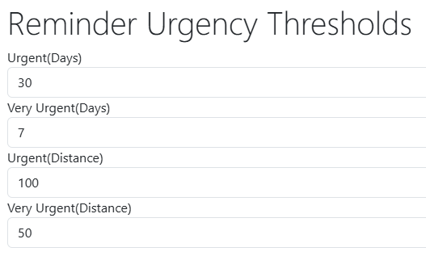
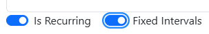
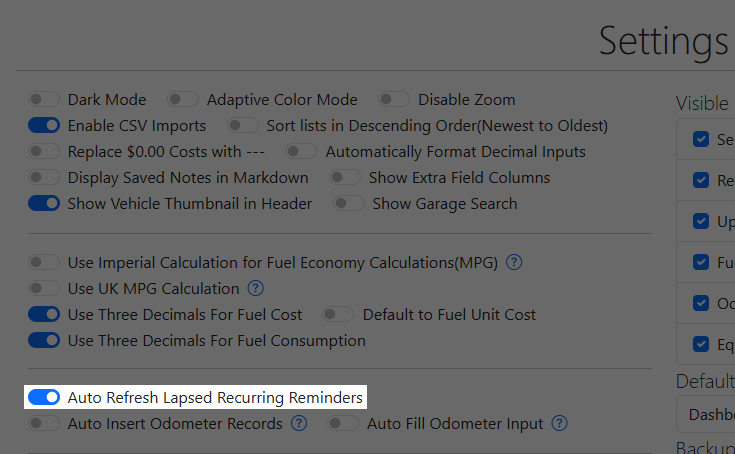
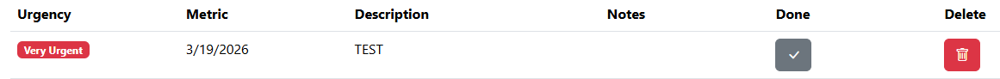
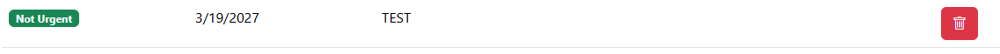
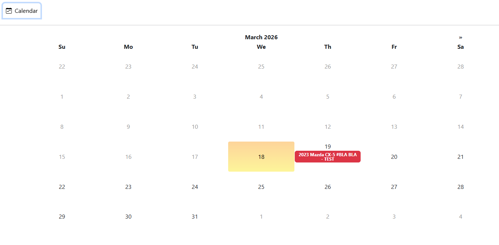
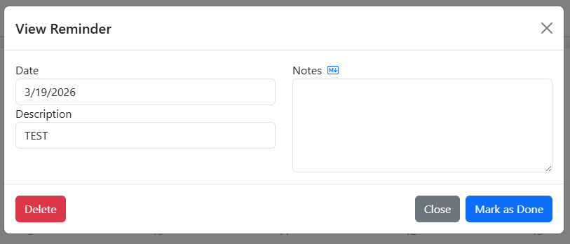

# Reminders

Reminders are future tasks where the urgency are based on how close the user is to the due date or odometer reading.

## Adding Reminders
Reminders can either be added directly on the Reminders tab by clicking the "Add Reminder" button or via adding a new [Service/Repair/Upgrade Record](/Records/Service Records#adding-reminders).

## Reminder Metrics
Similar to the maintenance schedule outlined in your vehicle's user manual, the urgency of a Reminder can be set either via a due date, a future odometer reading, or whichever comes first.

## Reminder Urgency
Depending on the metric selected, reminder urgency is calculated either via the server's current date, the max odometer reading across the Odometer/Service/Repair/Upgrade/Fuel tabs, or whichever comes first.

| Urgency    | Due Date      | Future Odometer Reading |
| ---------- | ------------- | ----------------------- |
| Not Urgent | > 30 days out | > 100 miles out         |
| Urgent     | < 30 days out | < 100 miles out         |
|  Very Urgent          |     < 7 days out         |        < 50 miles out                 |
|   Past Due         |   > 0 days past            |     > 0 miles past                    |

The Root User can also set up custom reminder urgency thresholds in the Server Settings Configurator

## Recurring Reminders
Reminders can be set to become recurring so that you don't have to create a new reminder for recurring maintenance such as oil changes. When you have completed the task set by the reminder, you can either have it automatically refresh when it lapses or by manually refreshing it. Refreshing a reminder effectively pushes out the due date or the odometer reading based on the recurring interval, i.e.: if a Reminder is due at 10000 miles and the interval is set at every 5000 miles, refreshing the Reminder will push the future odometer reading out to 15000 miles.

### Fixed Intervals
Recurring Reminders are typically refreshed based on the date or mileage it was pushed back. For example, for an oil change reminder that is due on 10,000 miles and is set to be recurring every 10,000 miles, if you refreshed the reminder early at 7500 miles, the new due mileage will be at 17,500 miles instead of 20,000. 

However, this logic doesn't hold for certain reminders such as Vehicle Registration where the user can pay ahead of the due date i.e.: if your vehicle registration expires on December 31st every year, paying your registration on December 15th doesn't mean your registration will expire on December 15th of the next year. For this behavior, "Fixed Intervals" must be checked for the recurring reminder so that due dates and mileage isn't getting shifted forward.

### Automatically Refresh Past Due Reminders
There is a setting within the Settings tab that allows users to automatically refresh past due reminders. Note that with this setting enabled, any reminder that becomes Past Due will be automatically refreshed, this requires a lot of diligence from the user to heed their reminders and stay on top of it.

### Manually Refresh Reminders
Recurring Reminders can be refreshed when any Service/Repair/Upgrade/Tax Records are created or when a Plan Record is marked as done.

When a recurring reminder falls into Very Urgent or Past Due status, there will be a button on the Reminders page that will allow the user to manually refresh the reminder.

This reminder is set to be recurring every 1 year, so when the "Done" button is clicked, it will push the due date of this reminder to 3/19/2027.

## Reminder Emails
If SMTP is configured within LubeLogger, the Root User can set up a cron / scheduled task that runs at an interval to send out emails to collaborators of vehicles with reminders. The API endpoint allows the user to specify what level of urgencies should the user be notified of.

[Sample bash script](https://github.com/hargata/lubelog_scripts/blob/main/bash/sendreminders.sh)

The sample provided above will send email reminders out for reminders of all urgencies.

## Shop Calendar
The shop calendar accessible on the homepage allows users to view all reminders with date metrics in a calendar view.

Clicking on the individual reminder item brings up a simplified, readonly prompt displaying additional information for the reminder. If it's a recurring reminder, you will also have to option to postpone / mark the reminder as done if it's in either past due or very urgent status.

### Inconsistent Reminder Urgency
This tends to happen with reminders that have both a date and odometer metric. Since the Calendar is only concerned about the date metric, it calculates the urgency of the reminder based solely on the date metric. Which means that a reminder can be in "Very Urgent" status when viewed in the Reminders tab but is displayed as "Urgent" in the Calendar.
