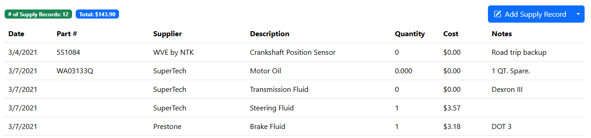
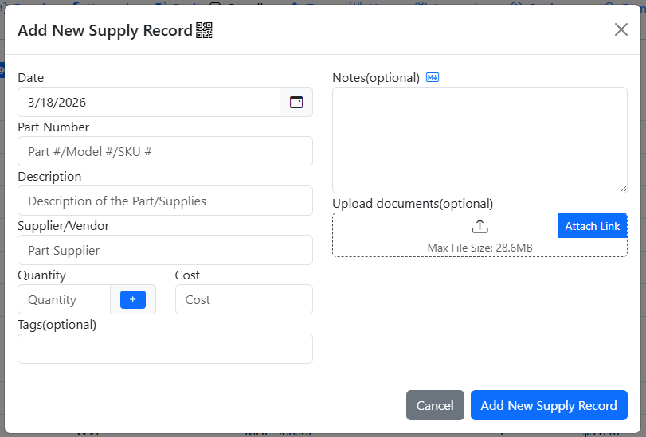
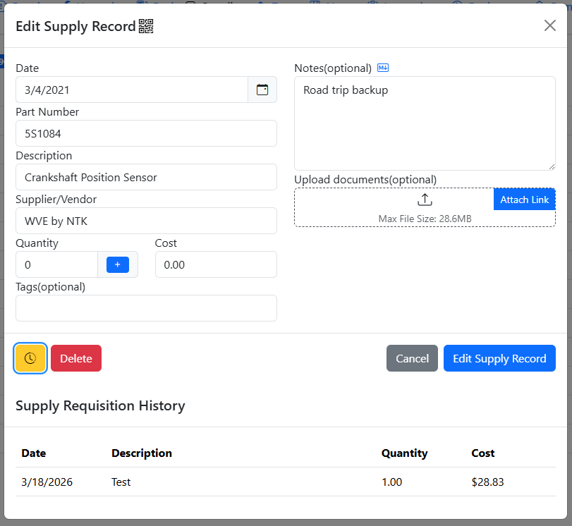
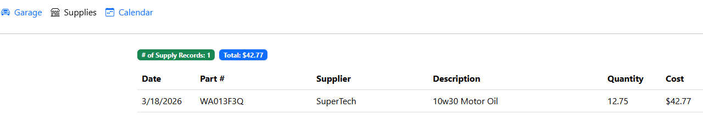
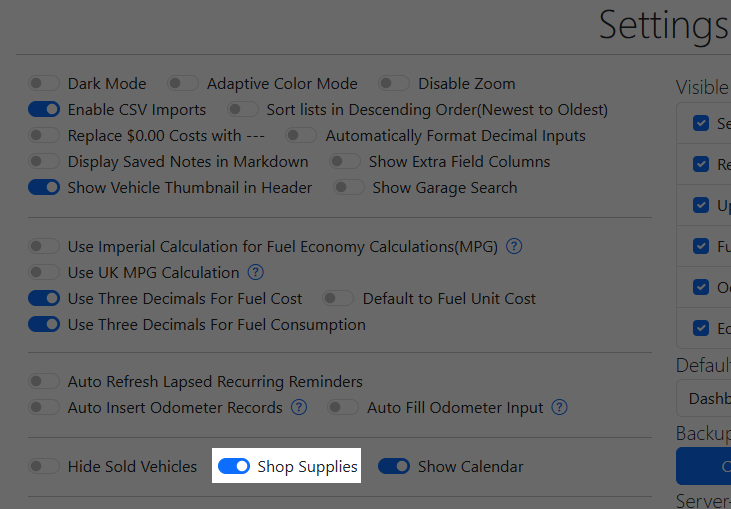

# Supplies

The Supplies tab is where you can keep track of supplies or parts purchased for your vehicle, either as spare parts or for future use.

To add a new Supply Record, simply click the "Add New Supply Record" button and you will be prompted for the details of the Supply.

Supplies that are in the system that have a quantity greater than zero are available for [Requisitioning](/Records/Service Records#supplies-requisition)

## Requisition History

You can view which records have requisitioned from a supply by clicking on the yellow Clock/History button to the left of the Delete button.

## Shop Supplies

Shop supplies are for supplies that are at a garage level and is available for requisitioning across all vehicles. This is useful for supplies that are shared across multiple vehicles such as motor oil, washer fluid, tires, etc.

This tab is disabled by default, but can be enabled by the Root User in the Settings tab.

Note that shop supplies are available for all users and all vehicles, do not enable this if you don't wish to share supplies with other users. When enabled, any user can add / edit / delete any shop supplies.
