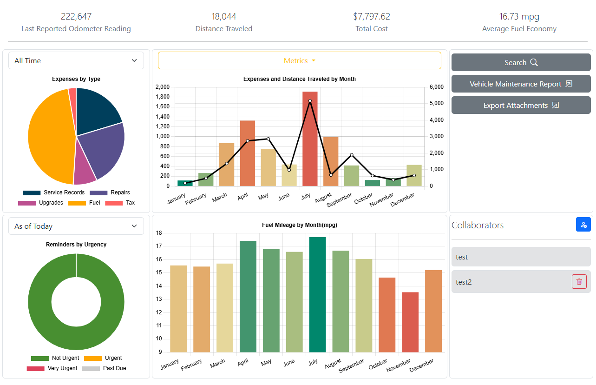
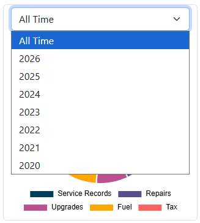
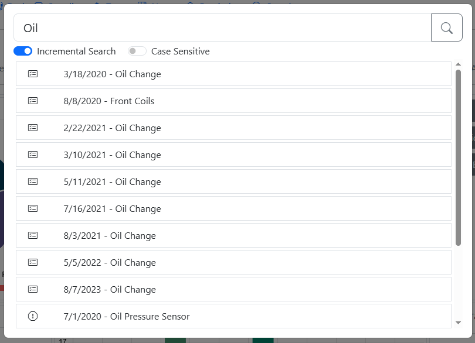
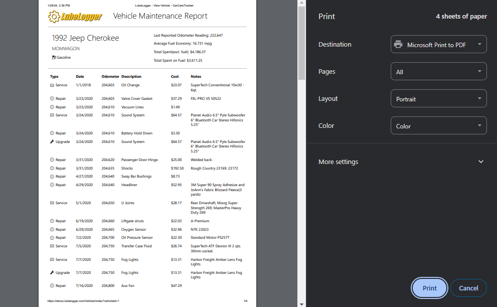
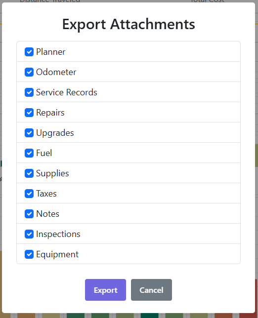

# Dashboard

The Dashboard is where you get an overview of your vehicle. It is the default tab that the user will see when they click into a vehicle and it is also the only tab that cannot be hidden.

The Dashboard includes the following data:

- Expenses By Type By Year/All Time(Top-Left)

- Total Expenses By Month and Distance Traveled By Year/All Time(Top-Center)

- Vehicle Maintenance Report Generator(Top-Right)

- Reminders by current date or future date(Bottom-Left)

- Fuel Mileage By Month By Year/All Time(Bottom-Center)

- Collaborators(Bottom-Right), see [Adding Collaborators](/Vehicles/Collaborators)

## Filtering Data by Year
The year dropdown above the pie chart(top-left) allows the user to filter the aggregated data by year. The year selections are populated by retrieving all years between the year of the oldest record and the current year. If the oldest record is less than 5 years old, the selections will still be populated by the last 5 years.

Note: Changing the selected year will automatically refresh the Expenses by Type Pie Chart, the Total Expenses by Month and the Fuel Mileage By Month Bar Charts.

### Notes on Distance Traveled
The Distance Traveled chart relies solely on the odometer records found in [Odometer](/Records/Odometer)

## Global Search
The Global Search function allows the user to search for keywords across different records. Note that the search results are dependent on the visible tabs, i.e.: the user will not get results in Service Records if the Service Records tab is not visible. Incremental Search is enabled by default, which means that the app will search as the user is typing, this can cause performance issues if you have a large amount of records, so it is recommended that incremental search is disabled and search be performed manually by either pressing the Enter key or clicking the Search button.

## Vehicle Maintenance Report
The Vehicle Maintainence Report Generator is a button that will generate a consolidated report of all work performed on the vehicle. For performance reasons, this report is designed to be printed as soon as it is generated. You can either choose to print it to paper or PDF.

## Export Attachments
The Export Attachments button provies a convenient feature to export all attachments into a chronologically-ordered zip file. Upon clicking the button, you will be prompted to select which tabs you want attachments to be exported from.

Once you have made your selection, a zip file will be created and downloaded onto your computer. This zip file contains all of the attachments and are named in chronological order(i.e.: the oldest attachment will be named 0 and the second oldest attachment 1, 2...)
