# Vehicle Management

## Adding a Vehicle
To add a vehicle, simply click on the green "+" button in the "Garage" tab. A dialog will then prompt you for the following details of the vehicle you wish to add: Year, Make, Model, License Plate, and optionally, a picture of the vehicle. If it's an Electric Vehicle, you should check the "Electric Vehicle" switch. This ensures that "fuel" economy is measured in kWh instead of gallons or liters.

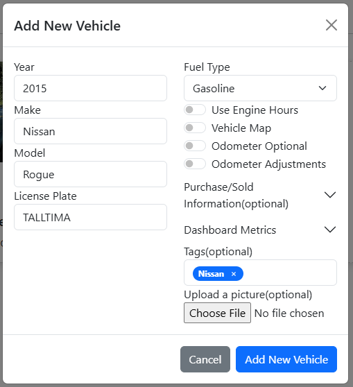

Once you're done, click "Add New Vehicle" and the vehicle will now be visible in the Garage Tab.

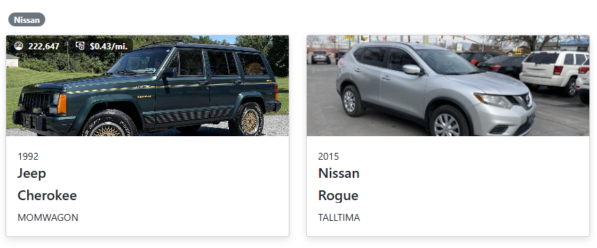

### Vehicle Images
LubeLogger scales the vehicle's image based on the screen width of your device, which means that photos can be unintentionally cut-off/cropped if the vehicle is not within certain margins/paddings. We have created [this tool](https://hargata.github.io/hargata/lubelog_camera/) to allow you to take photos that always displays the vehicle regardless of screen size.

For users who want to scale the images themselves, please see the following guidelines:
- 4:3 aspect ratio
- vehicle must be 27.75% from the top and bottom(if the image is 1200px tall then it must be at least 333px from the top/bottom)
- vehicle must be 4.875% from the left and right(if the image is 1600px wide then it must be at least 75px from the left/right)

### Vehicles and Equipment without a License Plate
LubeLogger can also be used to track other vehicles/equipment that aren't necessarily road-legal such as forklifts/golf carts/lawn mowers/etc. Since these vehicles do not have license plates and LubeLogger uses the License Plate field as an identifier by default, you may add an Extra Field at the Vehicle level so that the vehicle/equipment can still have an identifier. You must be logged on as the root user in order to set up Extra Fields. You can then set the extra field as the Vehicle Identifier, and the License Plate field will become optional.

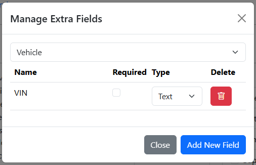

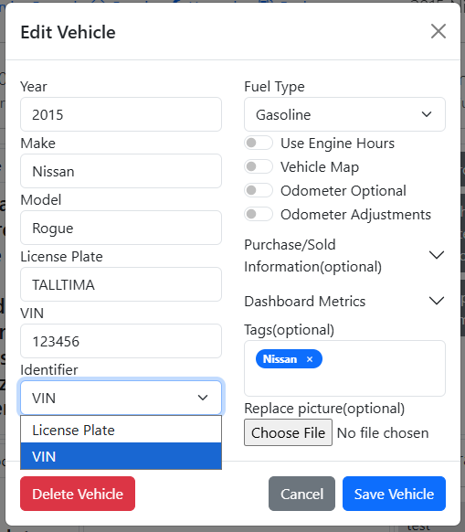

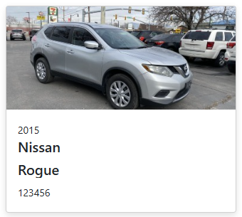

### Purchase and Sold Information
These optional fields are used to calculate duration of ownership as well as any depreciation or appreciation costs. For length of ownership, you must provide a Purchase Date, if Sold Date was not provided, LubeLogger will calculate the amount of days between the current day and the Purchase Date as length of ownership. If both Purchase and Sold Costs are provided, LubeLogger will calculate any depreciation / appreciation costs as well as the cost per mile and cost per day. These data will show up in the Vehicle Maintenance History Report under its own section.

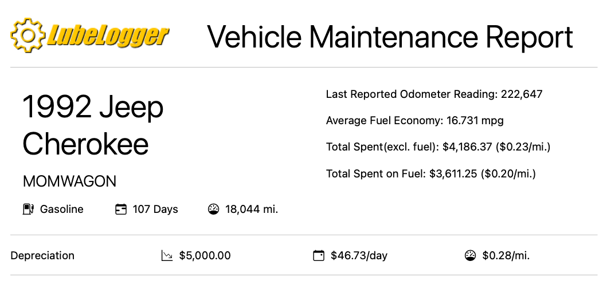

### Odometer Adjustments
Odometer Adjustments are conversions that will be applied to the odometer field when **adding** a new Service/Repair/Upgrade/Fuel Record.

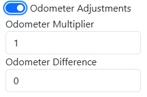

#### Odometer Multiplier
The multiplier that will be applied on the record's odometer field. Primarily used for vehicles where the odometer uses a different unit compared to the user's settings. E.g.: A user residing in the U.S. or U.K. which uses miles as the distance unit imports a vehicle that uses kilometers(Kei trucks, motorcycles, etc). 

The user will have to enter 0.621 as the odometer multiplier to convert kilometers to miles. When the user creates a new record, they can just enter the reading off the odometer in the vehicle(i.e.: 15000 km) and the app will automatically convert it to 9315 miles when the record is being saved. In the opposite scenario where a user imports a vehicle with miles as its distance and they use kilometers by default, they will have to enter 1.609 as the odometer multiplier.

Note that this field has a limit of 3 decimal places.

#### Odometer Difference
This is primarily used for vehicles where the dash cluster was swapped out and hence the odometer no longer reflects actual mileage. E.g.: The user swapped out the dash cluster when their vehicle had 200000 miles but the new dash cluster only has 15000 miles. The user will have to enter 185000 as the odometer difference. The next time the user creates a new record, they can just enter the reading off the odometer in the vehicle(i.e.: 17500 miles) and the app will automatically add 185000 to the odometer field when the record is being saved. The user can also input negative values in here if the new dash cluster has more miles than the user's original odometer.

Note that this field only takes in whole numbers(no decimals).

Note that in the event the user has a negative odometer difference, the record will not save if the odometer field falls below 0 after applying the odometer difference, it will throw a validation error.

#### Odometer Difference and Multiplier Combined(Edge Case)
The app will always apply the odometer difference first before applying the multiplier. Therefore if a dash cluster swap was performed the user must input the converted odometer difference.

### Sorting Vehicles
To sort vehicles by Year, simply right click(long hold on mobile) on the vehicle tile and click "Sort"

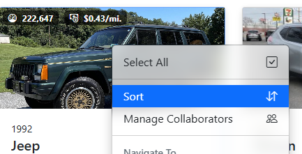

## Editing a Vehicle
To edit an existing vehicle, go into the vehicle details by clicking on the vehicle tile in the Garage, then click on the vehicle identifier on the top right(top center on mobile) of the screen

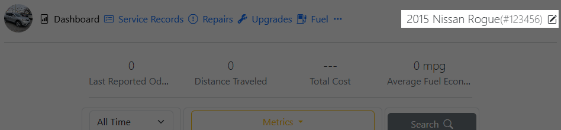

On mobile devices, a separate "Edit Vehicle" button is available within the menu

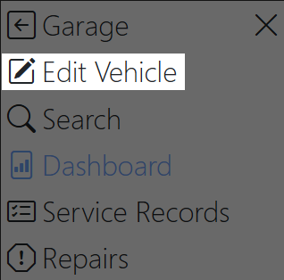

## Deleting a Vehicle.
To delete an existing vehicle, edit the vehicle and click "Delete Vehicle" located on the bottom left of the popup

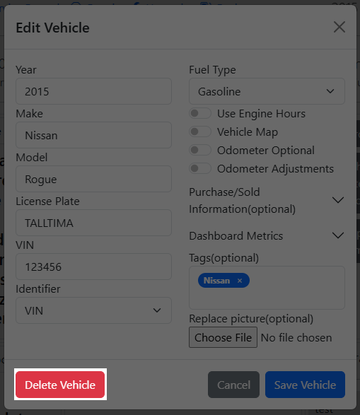