# Webhook

To add a webhook to LubeLogger, you just have to add the WebHook URL in the Server Settings Configurator

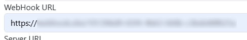

Example payload:

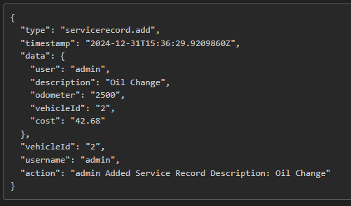

Triggers:

- Vehicle - Create/Edit/Delete
- Service Record/Repair/Upgrade - Create/Edit/Delete/Move/Adjust Odometer/Duplicate
- Odometer - Create/Edit/Delete/Adjust Odometer/Duplicate
- Fuel/Tax/Supply/Notes/Reminders - Create/Edit/Delete/Duplicate

Adding records via the API will also trigger the above webhook.

## Discord Webhook

LubeLogger supports using Discord Chatrooms as a webhook as of 1.4.2, to use Discord as a webhook, change the `https://` in the beginning of the webhook URL to `discord://`

`https://discord.com/api/webhooks/...` 

will turn into 

`discord://discord.com/api/webhooks/...`

Example Discord Webhook Payload:

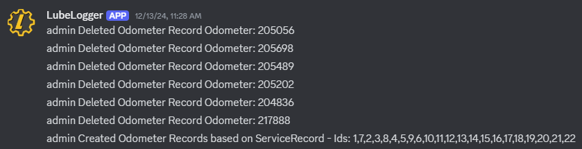

# WebSocket

Web sockets allows multiple external applications to subscribe to events, unlike webhooks which only allows for one subscriber at a time. Web Sockets also enables real-time sync within LubeLogger which is the ideal approach for [Kiosk](/advanced/kiosk) mode.

Web socket can be enabled in the [Server Settings Configurator](/installation/server settings)

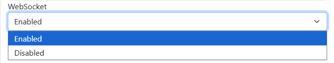

## Testing WebSocket Connection

Web sockets are implemented through SignalR hubs, which provides fallbacks such as SSE and long-polling if operating under unsupported environments. For this example, we will assume that web sockets are enabled and supported.

In PostMan(or your preferred RestApi tester), select WebSocket as the connection type:

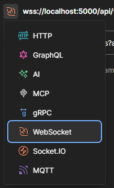

If authentication is enabled, you will need to generate an api key(viewer permission) and append it. If your LubeLogger instance is served over a https connection, use `wss://` otherwise use `ws://`

Example URL:

```
wss://your/lubelogger/domain/api/ws?apiKey=<apiKey>
```

Click connect and it should succeed

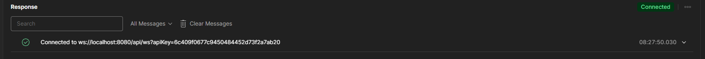

You will then send a few messages to set the protocol and join either one of these groups:

- kiosk
- vehicleId_{id of the vehicle}

The `kiosk` group allows you to subscribe to changes across all vehicles in the your garage, where as the vehicleId_{id of the vehicle} group allows you to subscribe to changes only from that vehicle.

Because the messages contains the non-printing character `0x1e` (RS), they can be found on this [gist](https://gist.github.com/hargata/d9dc0ce127e6fb24f877886a7e395c2e) instead of being in this wiki.

This message sets the protocol

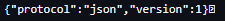

After sending this, you will start receiving heartbeats from the websocket

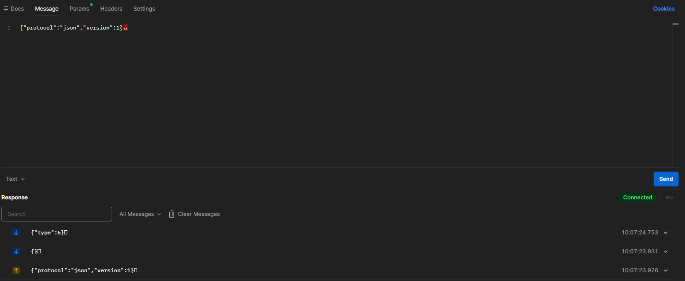

This message joins the kiosk group

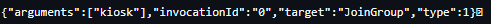

After sending this, you will start receiving events for all vehicles in the garage.

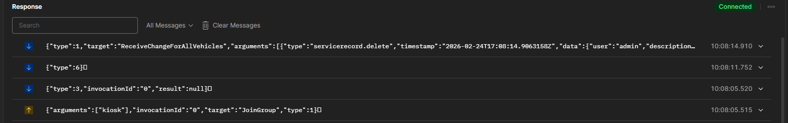

This message joins the group for vehicleId 1

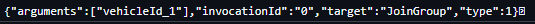

If you're already joining the kiosk group, joining the vehicleId groups is redundant.

## Notes on WebSocket Security

Unlike webhooks which publishes all events for all vehicles to a centralized endpoint, users will only receive events based on the vehicles they have access to. An API Key generated by a root user will receive events from all vehicles in the system.

## Notes on Reverse proxy

If you are running LubeLogger behind a reverse proxy, you will need to configure your proxy to upgrade and forward the websocket connection correctly.

Sample NGINX Configuration:

```
location /api/ws {
	proxy_pass http://127.0.0.1:8080;
    proxy_http version 1.1;
    proxy_set_header Upgrade $http_upgrade;
    proxy_set_header Connection "upgrade";
    proxy_set_header Host $host;
    proxy_cache_bypass $http_upgrade;
}
```
