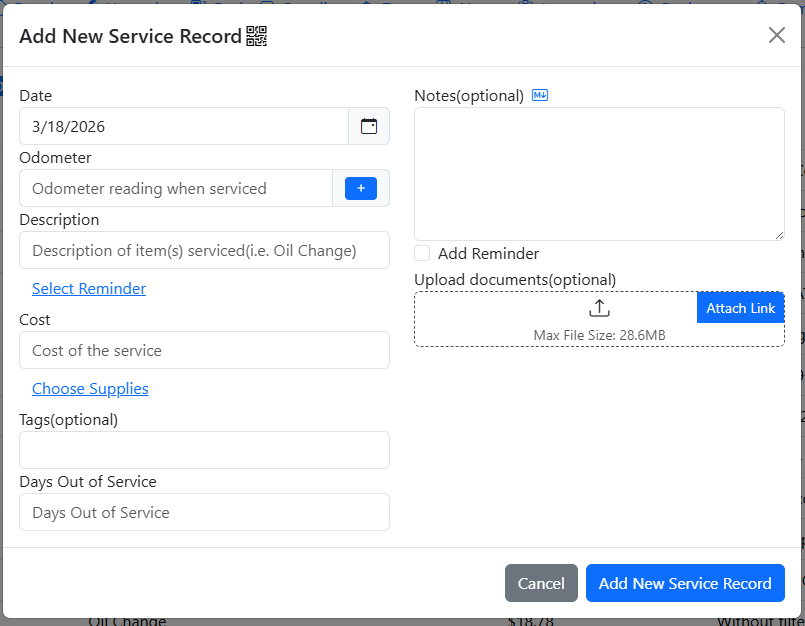
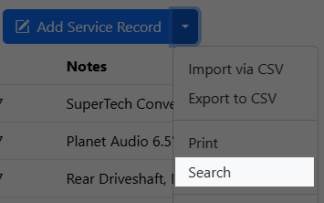
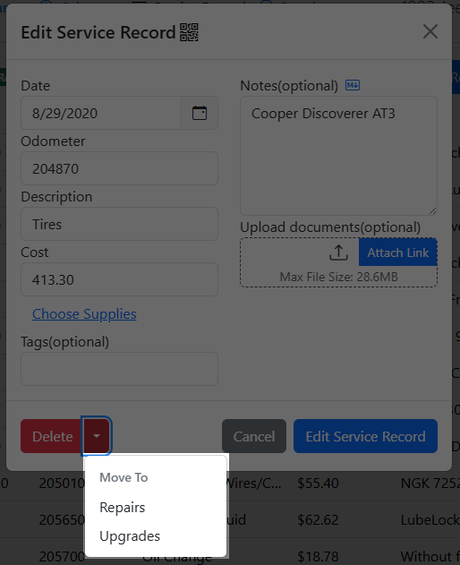
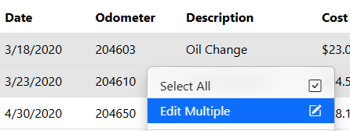
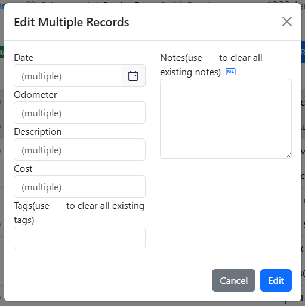
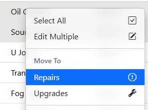
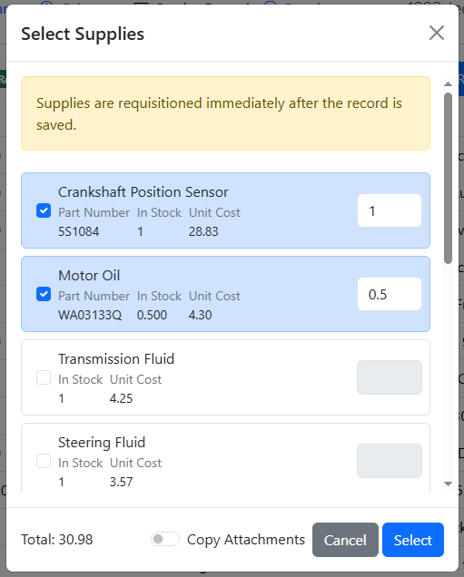
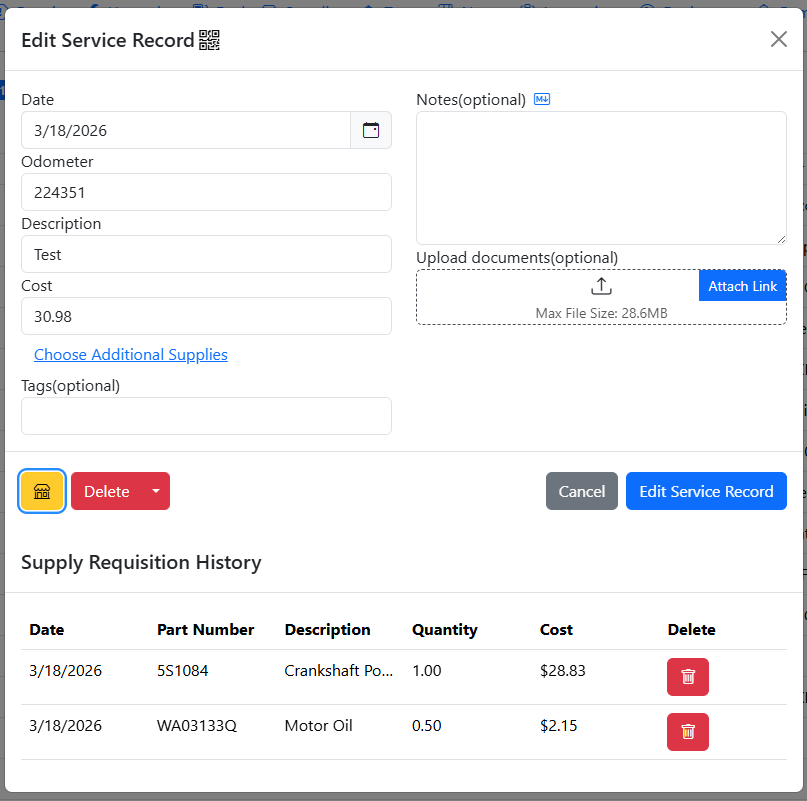
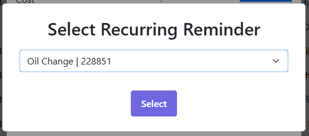

# Service/Repair/Upgrade Records
These three are perhaps the most important tabs in LubeLogger. They are functionally identically to one another, except for the type of records stored in them.

Service Records: These are planned/scheduled maintenance performed on the vehicle, usually on a fixed interval. Examples include oil changes, brakes, tires, spark plugs, air filter.

Repair Records: These are unplanned/unscheduled work performed on the vehicle whether due to an accident, a component breaking unexpectedly, or a broken component with no fixed maintenance interval. Examples include replacing the alternators, starters, radiators, power steering pump, bumpers.

Upgrade Records: These are work performed on the vehicle that enhances the functionality or aesthetics of the vehicle. Examples include: roof racks, lift kits, aftermarket wheels, stereos.

To add a new record, simply navigate to the tab and click the "Add New Service/Repair/Upgrade Record" button and you will be prompted to input the details of the record.

## Searching Records
To search through records, simply click on the dropdown button to the right of the Add Record button and select "Search". This is also where you can toggle column visibilities.

A dialog will then prompt you to enter the keyword to search by, note that the keyword is case sensitive. LubeLogger will then search through the records and return records that contain the keyword. i.e.: oil will return "Coils" but not "Oil". The search works for all columns including columns of additional fields but only if "Show Extra Field Columns" option is enabled.

### Column-specific Search
To perform a column-specific search, e.g.: only show records with "Oil" in the Description, you can structure your search keyword as such: `Description=Oil`. Description being the name of the column and Oil being the case-sensitive keyword. If you have translations applied, you can use the translation for 'Description' in its place.

## Moving Records
To move existing records between the three tabs, simply click on the dropdown button to the right of the Delete button and select the tab to move the record to.

## Bulk Operations
You can perform bulk operations on multiple records at the same time, for bulk operation details across all tabs, see [Bulk Operations](/records/bulk operations)

### Bulk Edit
To edit multiple records at once, simply select more than one record, then right click and select "Edit Multiple"

The multi-record editor will then be displayed, you can overwrite the existing data in those records you wish to edit by inputting data into the fields. Fields left blank means that the existing data for those fields will be unmodified.

#### Clearing Tags and Notes

To clear out tags and notes for the selected records, simply add a tag with the text "---" or enter "---" in the notes field and the existing data for those fields will be cleared out.

### Bulk Move
To move multiple records at once, simply right click on the records you wish to move and select the tab you wish to move those records to.

You will then be prompted for confirmation before those records are moved.

## Supplies Requisition
If you have supplies set up, you can click the "Choose Supplies" link under the Cost field, and a dialog will prompt you to select the supplies and quantity of each supplies you wish to requisition for this record.

Once you have selected the supplies, the Cost field will automatically update to reflect the costs of the supplies you have selected based on the quantity of each supply. Note that at this point, before the record is created, the supply is not requisitioned yet and you can still edit the selected supplies/quantities.

Once the record has been created, the supplies will be requisitioned and the quantity / cost of the supplies will be deducted according to the usage. This cannot be reversed(i.e.: you cannot restore the quantities by editing an existing service/repair/upgrade record), you have to go to the Supplies tab to correct the quantity/cost of the supply.

### Supplies Unit Cost Calculation
LubeLogger is not an inventory management system. Unit costs are calculated as an average of total spent / quantity, which means that everytime you replenish your supplies, it will average out the cost even if the latest batch of supplies you purchased is significantly costlier than the last batch. There is no LIFO/FIFO/FAFO inventory valuation methods.

### Supplies Requisition History
To view supplies that have been requisitioned for a specific record, simply click on the yellow Shop button to the left of the Delete button

For more information on Supplies, see [Supplies](/records/supplies)

## Reminders

### Attach Existing Reminder
You are given the option to attach an existing, recurring reminder upon creating a new record. Once the record is created, the recurring reminder will be pushed back by its set interval.

### Adding Reminders
You are given the option to set a reminder upon creating a record. This is helpful for recurring services such as Oil Changes. To do so, simply check the "Add Reminder" switch before clicking the "Add New Service Record" button. A new dialog will show up after the record has been created and all the fields will be pre-populated.

For more information on Reminders, see [Reminders](/records/reminders)

## Attachments

You can add attachments in the form of files, links, and even other records.

### Linking to Other Records

To link to other records, add a link attachment with a location in the following format

`::RecordType:RecordId`

So linking to a Service Record with Id 1 will look like

`::ServiceRecord:1`
